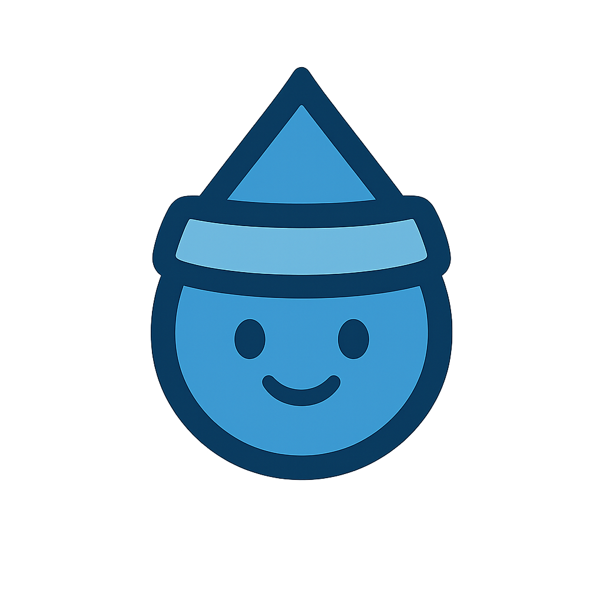

<div align="center">
  
  
  # Hydrovisor
  
  [](https://opensource.org/licenses/MIT)
  [](https://github.com/roboflow/hydrovisor)
  [](https://www.typescriptlang.org/)
  [](https://reactjs.org/)
  [](https://roboflow.com)
  
  **Your AI-powered hydration companion that uses your webcam to detect real drinking moments — no manual logging required.**
</div>

---

## ✨ Features

- 🎥 **Real-time Detection** - Automatically detects when you're drinking using webcam
- 🤖 **AI-Powered** - Face detection + object recognition (cups, bottles, glasses)
- 📊 **Smart Tracking** - Logs hydration events automatically
- ⏰ **Reminders** - Customizable intervals with sound notifications
- 🎨 **Visual Feedback** - Background pulses orange when drinking detected

## 🚀 Quick Start

```bash
npm install
npm run dev
```

Open http://localhost:5173 and grant camera permission.

## ⚙️ Configuration

### Environment Variables
```env
VITE_ROBOFLOW_PUBLISHABLE_KEY=your_key
VITE_ROBOFLOW_MODEL_NAME=your_model
VITE_DETECTION_CLASSES=cup,glass,bottle
```

### In-App Settings
- **Hydration Interval**: 1-60 minutes
- **Detection Model**: Choose between YOLO v8, RF-DETR Small, or RF-DETR Nano
- **Sound Notifications**: Toggle on/off

## 🛠️ Tech Stack

- **React 19** + **TypeScript** + **Vite**
- **TensorFlow.js** & **MediaPipe** for face detection
- **Roboflow InferenceJS** for object detection
- **Zustand** for state management
- **TailwindCSS** for styling

## 🔒 Privacy

- All processing happens locally in your browser
- No video is stored or transmitted
- Settings persist locally via localStorage

## 📝 License

MIT © [Roboflow](https://roboflow.com)